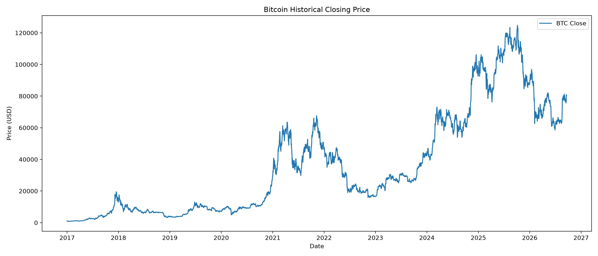
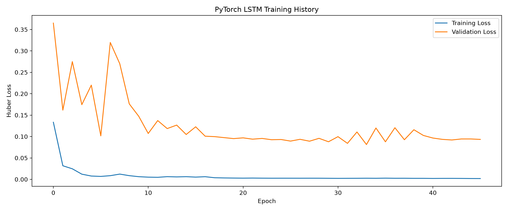
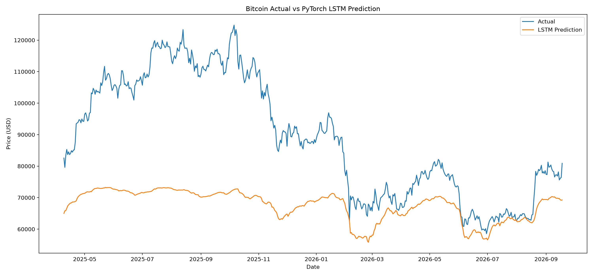
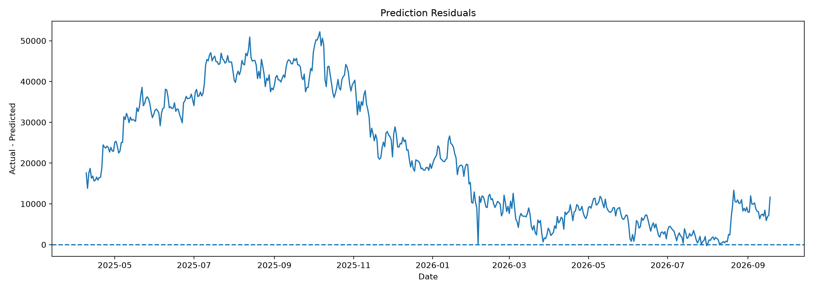

# 🚀 Cryptocurrency Price Prediction Using LSTM

## Algonive Internship Project

An end-to-end cryptocurrency time-series forecasting system developed as part of the **Algonive Internship**.

This project uses **historical Bitcoin market data**, technical indicators and a **PyTorch LSTM (Long Short-Term Memory)** neural network to estimate the next-day closing price of Bitcoin.

The project goes beyond a basic LSTM notebook by including:

* Automated historical market-data collection
* Data validation and cleaning
* Technical feature engineering
* Leakage-safe chronological data splitting
* Feature normalization using training data only
* 60-day time-series sequences
* Stacked PyTorch LSTM architecture
* Dropout regularization
* Huber loss
* Adam optimization
* Gradient clipping
* Learning-rate scheduling
* Early stopping
* Model checkpointing
* RMSE, MAE, MAPE and R² evaluation
* Directional accuracy
* Naive baseline comparison
* Residual analysis
* Monte Carlo Dropout uncertainty estimation
* Saved model and preprocessing artifacts
* Streamlit dashboard
* Latest-available-market-data inference
* Reproducible project structure

---

# 📌 Project Overview

Cryptocurrency prices are highly dynamic and contain complex temporal patterns.

The goal of this project is to develop a deep-learning time-series forecasting pipeline that learns from previous cryptocurrency market observations and estimates the following day's closing price.

The workflow is:

```text
Yahoo Finance
      ↓
Historical BTC-USD Data
      ↓
Data Validation & Cleaning
      ↓
Technical Feature Engineering
      ↓
Chronological Train / Validation / Test Split
      ↓
Feature Scaling
      ↓
60-Day Sequence Creation
      ↓
PyTorch LSTM
      ↓
Next-Day Price Prediction
      ↓
Model Evaluation
      ↓
Baseline Comparison
      ↓
Uncertainty Estimation
      ↓
Saved Model Artifacts
      ↓
Streamlit Dashboard
```

---

# 🎯 Project Objective

The main objective is to build a practical machine-learning system that can:

1. Collect historical Bitcoin market data.
2. Clean and validate the dataset.
3. Generate useful time-series and technical features.
4. Convert the data into sequential observations.
5. Train an LSTM neural network.
6. Predict the next-day Bitcoin closing price.
7. Evaluate the model using multiple regression metrics.
8. Compare the LSTM against a simple baseline.
9. Estimate prediction uncertainty.
10. Serve the trained model through a Streamlit application.

---

# 🪙 Cryptocurrency Used

The current implementation uses:

```text
Ticker: BTC-USD
Cryptocurrency: Bitcoin
Currency: USD
```

The data is collected using the `yfinance` Python package.

---

# 📊 Data Source

Historical cryptocurrency market data is obtained from Yahoo Finance through `yfinance`.

The downloaded data contains:

* Date
* Open
* High
* Low
* Close
* Volume

The system can retrieve the latest available market data when the Streamlit application is refreshed.

---

# 🧹 Data Preprocessing

The raw market data is processed before being used by the model.

The preprocessing pipeline includes:

* Date conversion
* Numeric type conversion
* Missing-value handling
* Duplicate-date removal
* Chronological sorting
* Feature generation
* Invalid/infinite-value removal

The resulting dataset is then prepared for time-series modelling.

---

# 🧠 Feature Engineering

Instead of using only the closing price, the model receives multiple market and technical features.

## Price Features

* Open
* High
* Low
* Close
* Volume

## Return Features

* 1-day return
* 7-day return
* 30-day return

## Trend Features

* 20-day Simple Moving Average
* 20-day Exponential Moving Average
* 50-day Exponential Moving Average
* Price relative to EMA 50

## Momentum Features

* 7-day momentum
* 30-day momentum

## Technical Indicators

* RSI 14
* MACD
* MACD Signal
* MACD Histogram
* ATR 14
* Bollinger Band Width

## Volatility Features

* 20-day return volatility

## Volume Features

* Volume change
* 20-day volume z-score

---

# 🎯 Prediction Target

The target variable is the **following day's closing price**.

Conceptually:

```text
Today's market information
          ↓
       LSTM Model
          ↓
Tomorrow's closing price
```

The target is generated using:

```python
df["Target_Close"] = df["Close"].shift(-1)
```

---

# ⏳ Time-Series Sequence Design

The model uses a **60-day lookback window**.

For each prediction, the model receives the previous 60 days of information.

Example:

```text
Day 1
Day 2
Day 3
...
Day 60
   ↓
 LSTM
   ↓
Day 61 prediction
```

The next sequence then moves forward one day:

```text
Day 2
Day 3
...
Day 61
   ↓
 LSTM
   ↓
Day 62 prediction
```

This creates overlapping time-series sequences.

---

# ⚠️ Leakage Prevention

A critical part of the project is preventing future information from leaking into model training.

The dataset is split chronologically:

```text
70% → Training
15% → Validation
15% → Test
```

The data is **not randomly shuffled before splitting**.

The feature and target scalers are fitted using the training data and then applied to validation and test data.

This ensures that future observations are not used to train the preprocessing pipeline.

---

# 🏗️ Model Architecture

The forecasting model is implemented using **PyTorch**.

Architecture:

```text
Input Sequence
60 Timesteps × Number of Features
             │
             ▼
        LSTM (128)
             │
             ▼
       Dropout (0.25)
             │
             ▼
         LSTM (64)
             │
             ▼
       Dropout (0.20)
             │
             ▼
      Dense Layer (32)
             │
             ▼
           ReLU
             │
             ▼
       Output Layer
             │
             ▼
   Next-Day BTC Price
```

---

# ⚙️ Training Configuration

The main training configuration includes:

```text
Lookback Window: 60 days
Batch Size: 64
Maximum Epochs: 80
Optimizer: Adam
Loss Function: Huber Loss
Learning Rate: 0.001
Early Stopping Patience: 12
Gradient Clipping: 1.0
```

A learning-rate scheduler is used to reduce the learning rate when validation performance stops improving.

The best validation model is saved as:

```text
artifacts/best_lstm_model.pth
```

---

# 📏 Model Evaluation

The model is evaluated on unseen test data using:

### RMSE

Root Mean Squared Error measures the square-root average of squared prediction errors.

```text
RMSE = Root Mean Squared Error
```

### MAE

Mean Absolute Error measures the average absolute difference between actual and predicted prices.

```text
MAE = Mean Absolute Error
```

### MAPE

Mean Absolute Percentage Error measures prediction error in percentage terms.

```text
MAPE = Mean Absolute Percentage Error
```

### R²

R² measures the proportion of variance explained by the model.

```text
R² = Coefficient of Determination
```

### Directional Accuracy

Directional accuracy measures whether the model correctly identifies whether the next price movement is upward or downward relative to the previous known closing price.

---

# 📊 Baseline Comparison

The project also uses a simple naive baseline.

The baseline assumes:

```text
Tomorrow's price = Today's price
```

The LSTM is compared against this baseline using:

* MAE
* RMSE

This provides a more meaningful evaluation of whether the LSTM is adding predictive value beyond a simple persistence forecast.

---

# 📉 Residual Analysis

Prediction residuals are calculated as:

```text
Residual = Actual Price - Predicted Price
```

Residual analysis is used to inspect when and where the model produces larger errors.

The analysis is stored in:

```text
reports/residuals.png
```

---

# 🎯 Uncertainty Estimation

The project includes **Monte Carlo Dropout** to provide an approximate model uncertainty interval.

Instead of producing only:

```text
Predicted Price
```

the system estimates a range such as:

```text
Forecast: $XX,XXX

Model Interval:
$XX,XXX - $XX,XXX
```

The displayed values are generated from the trained model and should be interpreted as model uncertainty rather than guaranteed market confidence intervals.

---

# 🌐 Streamlit Dashboard

The project includes an interactive Streamlit application.

The dashboard provides:

* Latest available BTC price
* Next-day model estimate
* Estimated percentage difference
* Model uncertainty interval
* Recent BTC price trend
* Forecast visualization
* RMSE
* MAE
* R²
* Directional accuracy
* Baseline comparison
* Latest data date
* Number of market records loaded

---

# ▶️ Run the Application

First activate the virtual environment.

### Windows PowerShell

```powershell
.\.venv\Scripts\Activate.ps1
```

Then run:

```bash
python -m streamlit run app.py
```

The application will open in your browser.

Typical local address:

```text
http://localhost:8501
```

---

# 💻 Python Environment

The project was developed using:

```text
Python 3.14.6
```

The deep-learning framework used is:

```text
PyTorch
```

TensorFlow is not required.

---

# 📦 Installation

Create a virtual environment:

```bash
python -m venv .venv
```

Activate it.

Windows PowerShell:

```powershell
.\.venv\Scripts\Activate.ps1
```

Upgrade pip:

```bash
python -m pip install --upgrade pip
```

Install PyTorch CPU:

```bash
python -m pip install torch==2.14.0 --index-url https://download.pytorch.org/whl/cpu
```

Install the remaining dependencies:

```bash
python -m pip install -r requirements.txt
```

---

# 📓 Run the Notebook

Open:

```text
notebooks/cryptocurrency_lstm_pytorch.ipynb
```

Select the project's `.venv` Python environment as the Jupyter kernel.

Run the cells sequentially.

The notebook performs:

```text
Data Download
      ↓
Data Inspection
      ↓
Feature Engineering
      ↓
Data Splitting
      ↓
Normalization
      ↓
Sequence Creation
      ↓
LSTM Training
      ↓
Evaluation
      ↓
Visualization
      ↓
Artifact Saving
```

---

# 📁 Project Structure

```text
Cryptocurrency_Price_Prediction_LSTM/
│
├── app.py
├── README.md
├── requirements.txt
├── .gitignore
│
├── data/
│   └── btc_usd.csv
│
├── notebooks/
│   └── cryptocurrency_lstm_pytorch.ipynb
│
├── src/
│   ├── __init__.py
│   └── features.py
│
├── artifacts/
│   ├── best_lstm_model.pth
│   ├── feature_scaler.pkl
│   ├── target_scaler.pkl
│   ├── model_config.json
│   └── metadata.json
│
└── reports/
    ├── historical_price.png
    ├── training_history.png
    ├── actual_vs_predicted.png
    ├── residuals.png
    └── streamlit_dashboard.png
```

---

# 📂 File Descriptions

## `app.py`

Streamlit application responsible for loading the trained PyTorch model, obtaining the latest market data, preprocessing the latest sequence and displaying the forecast.

## `src/features.py`

Contains:

* Yahoo Finance data download
* Data cleaning
* RSI calculation
* Technical indicators
* Feature engineering

## `notebooks/cryptocurrency_lstm_pytorch.ipynb`

Contains the complete model-development workflow and experimentation.

## `artifacts/best_lstm_model.pth`

Saved PyTorch model weights from the best validation epoch.

## `artifacts/feature_scaler.pkl`

Saved feature preprocessing scaler.

## `artifacts/target_scaler.pkl`

Saved target preprocessing scaler.

## `artifacts/model_config.json`

Contains model architecture and preprocessing configuration.

## `artifacts/metadata.json`

Contains model evaluation results and experiment metadata.

## `reports/`

Contains visualizations produced during model development.

---

# 📈 Results

After running the notebook, replace the placeholders below with the actual values generated by your model.

| Metric |           LSTM | Naive Baseline |
| ------ | -------------: | -------------: |
| MAE    | `INSERT_VALUE` | `INSERT_VALUE` |
| RMSE   | `INSERT_VALUE` | `INSERT_VALUE` |

Additional LSTM metrics:

```text
MAPE: INSERT_VALUE %
R²: INSERT_VALUE
Directional Accuracy: INSERT_VALUE %
```

**These values must come from the actual test-set evaluation.**

---

# 🖼️ Project Visualizations

## Historical Price



## Training History



## Actual vs Predicted



## Residual Analysis



## Streamlit Dashboard


---

# 🔬 Machine Learning Workflow

```text
                MARKET DATA
                     │
                     ▼
             DATA VALIDATION
                     │
                     ▼
          FEATURE ENGINEERING
                     │
                     ▼
         CHRONOLOGICAL SPLIT
                     │
                     ▼
             DATA SCALING
                     │
                     ▼
         60-DAY SEQUENCE DATA
                     │
                     ▼
             PYTORCH LSTM
                     │
                     ▼
            MODEL TRAINING
                     │
          ┌──────────┴──────────┐
          ▼                     ▼
     VALIDATION                TEST
          │                     │
          └──────────┬──────────┘
                     ▼
              MODEL METRICS
                     │
          ┌──────────┴──────────┐
          ▼                     ▼
       BASELINE             UNCERTAINTY
          │                     │
          └──────────┬──────────┘
                     ▼
             SAVED ARTIFACTS
                     │
                     ▼
             STREAMLIT APP
```

---

# 💡 Key Learning Outcomes

Through this project, the following practical concepts were implemented:

* Time-series forecasting
* Deep learning
* LSTM networks
* PyTorch
* Feature engineering
* Technical indicators
* Data normalization
* Temporal data splitting
* Leakage prevention
* Model validation
* Regression evaluation
* Baseline modelling
* Error analysis
* Uncertainty estimation
* Model serialization
* Streamlit deployment
* Git and GitHub workflow

---

# 🚀 Future Improvements

Potential
